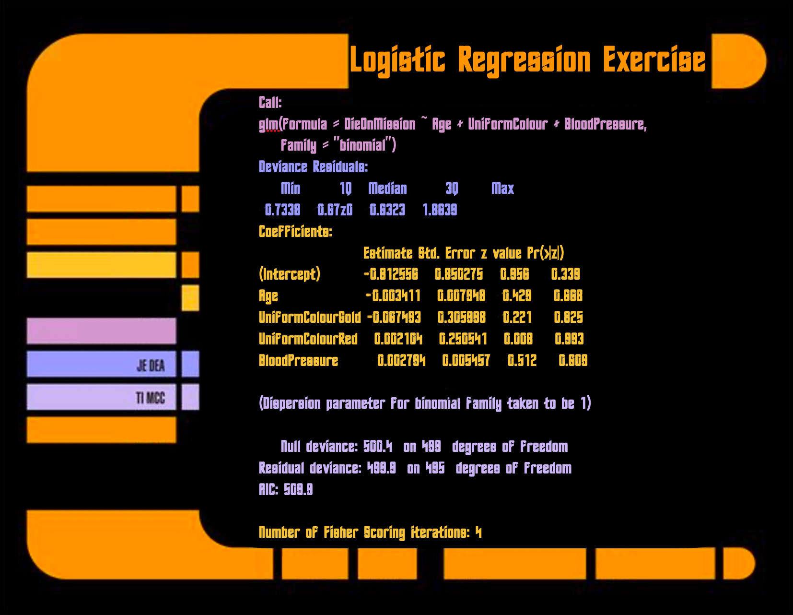

---
title:
output: webexercises::webexercises_default
---

<body style="background-color:black;">

```{r setup, include = FALSE}
knitr::opts_chunk$set(echo = TRUE)
if (!requireNamespace("webexercises")) {
  stop("You must have the 'webexercises' package installed to knit to HTML.\n   install.packages(\"webexercises\")")
} else {
  library("webexercises")
}
```

{.absolute right=-200 top=10 height=550 width=700}


<span style="color: orange;">Given the regression model:</span>

$$\color{orchid}{\LARGE Y_{i} = \beta_0 + \beta_1 X_{1i} + \beta_2 X_{2i} + \beta_3 X_{3i}}$$
<span style="color: orange;">Fill in the regression coefficients</span>

$\LARGE \color{orchid}{\hat{\beta}_0 =}$ `r fitb(-0.812556, width = 5, tol = .01)` $\LARGE \color{orchid}{\hat{\beta}_1 =}$ `r fitb(-0.003411, width = 5, tol = .01)` $\LARGE \color{orchid}{\hat{\beta}_2 =}$ `r fitb(-0.067493, width = 5, tol = .01)` $\LARGE \color{orchid}{\hat{\beta}_3 =}$ `r fitb(0.002104, width = 5, tol = .01)`

`r hide("Show answers")`

-   $\beta_0=$ `r -0.812556`
-   $\beta_1=$ `r -0.003411`
-   $\beta_2=$ `r -0.067493`
-   $\beta_3=$ `r 0.002104`
